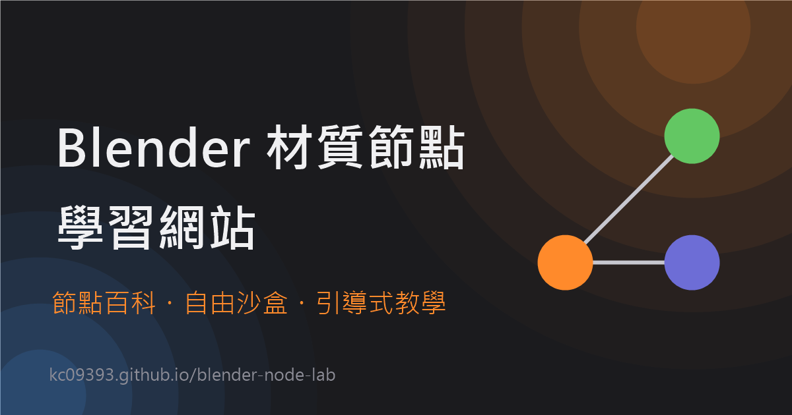

# Blender 材質節點

**Bilingual, interactive Blender shader-node learning site** — encyclopedia, live sandbox, guided tutorials.
免費、雙語（繁中／英文）的 Blender 材質節點互動學習網站，不是看影片，是真的拖節點、接線、即時看 3D 預覽反應。

**🌐 [kc09393.github.io/blender-node-lab](https://kc09393.github.io/blender-node-lab/)**



## 這個網站在做什麼

- 📖 **節點百科** — 依分類瀏覽所有材質節點，每個節點都有新手／進階雙層雙語說明與輸入輸出圖解
- 🧪 **自由沙盒** — 拖拉節點、自己接線，右側 3D 預覽即時反應每一次修改；可以一鍵產生分享連結，把自己做的材質丟給朋友
- 🎓 **引導教學** — 一步步做出玻璃、金屬、木紋等真實材質，每一步都有提示與自動驗證，部分教學還有結業小測驗
- 📐 **材質參考表** — 真實世界材質的 IOR 折射率／粗糙度／金屬反射率顏色速查表
- 🛠 **疑難排解** — 開發過程中真的踩過的坑，症狀對照原因跟修法

## 技術架構

純靜態網站，**沒有 build step、沒有框架**，ES modules 加瀏覽器原生 `<script type="importmap">` 直接載入 [Three.js](https://threejs.org/)（CDN）。GLSL 著色器透過 `MeshPhysicalMaterial.onBeforeCompile` 動態注入到既有的 fragment/vertex shader，重用 Three.js 內建的 PBR／IBL／色調映射管線，而不是自己刻一套渲染器。節點編輯器（拖拉/接線/縮放/復原重做）也是自己刻的，沒有用 Rete.js／React Flow 之類的既有函式庫。

新增一個節點＝在 `data/nodes/*.js` 加一筆資料定義（雙語文件＋`glsl.emit()`），不用動編輯器或編譯器核心。

## 本機開發

不需要任何建置流程，開一個靜態伺服器就能跑：

```bash
python -m http.server 5173
```

然後打開 `http://localhost:5173/index.html`。改完 `data/presets/*.js` 或 `data/tutorials/*.js` 記得整頁重新整理（巢狀 import 不會被強制重抓）。

`dev-regression-test.html` 是內部的資料完整性回歸測試頁（結構檢查＋編譯檢查），不在導覽列裡，直接開網址存取；同一份檢查也會在 CI（`.github/workflows/regression-test.yml`）用 headless 瀏覽器自動跑一次。

想貢獻節點／教學／預設材質，請看 [CONTRIBUTING.md](CONTRIBUTING.md)。

## License

[MIT](LICENSE)
